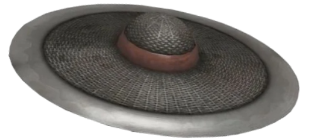

# while 

I like turning random ideas into working software

most of what I do starts as an experiment - small tools, game-related stuff, open source, or just something I wanted to understand better

| now                    | usually working with             | interested in      |
| ---------------------- | -------------------------------- | ------------------ |
| learning Java          | Lua · Python · Node.js           | game development   |
| learning Docker        | Git · Docker · Windows           | open source        |
| building random stuff  | IntelliJ IDEA · VS Code          | software internals |

## tools

## find me

[telegram](https://t.me/whilechannel) · [discord](https://discord.com/users/1349432967285706782)

---

if an idea sounds fun, i'll probably try to build it
